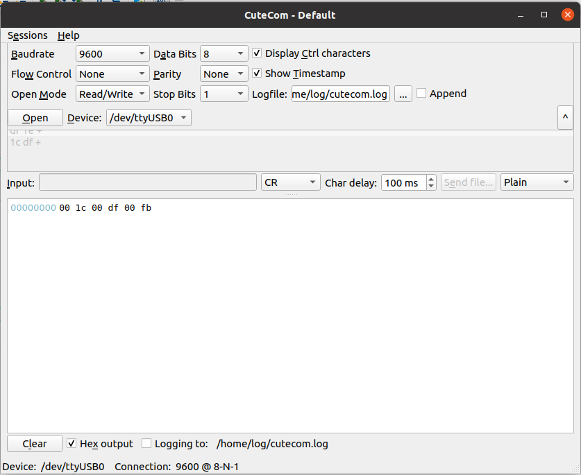
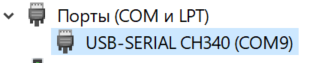
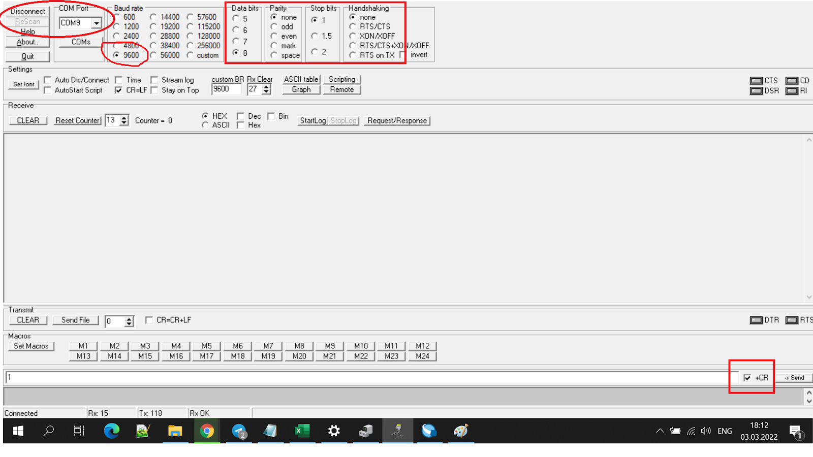

# Руководство пользователя

- Выражение вводится в обратной польской нотации. (т.е. **5 * 3 + 7** представляется в виде **5 3 * 7 +**).

- Числа распознаются в 16-ти ричной системе счисления в диапазоне от **0x00** до **0xff**.

- Для очищение стека калькулятора в поле *input* вводится символ **R** или **r**.

- Глубина стека регилируется в файле параметров `common/Calculator/defines.vh`.

- Поддерживаются операции {'+', '*'}.

- На плате есть кнопка сброса (`PIN_86` - zeowaa, `PIN_88` - RzRd), которая возвращает программу в начальное состояние.

# Инструкция UART для Linux

1. Установить СuteСom:

    `> sudo apt install cutecom`

2. Запустить программу:

    `> cutecom`

3. Выставить настройки для отправки:

    ``` text
    Boundrate: 9600
    Data bits: 8
    Stop bits: 2
    Parity: none
    ```

    *Остальные по умалчанию*

4. Выбрать нужное устройство (**Device**)

5. В поле **Input** выбрать **CR** (После отправки идёт бит с возвратом каретки).

6. В самом низу окна установить флаг **Hex output**

7. Нажать на кнопку **Open**  для открытия канала связи.



---

# Инструкция UART для Windows

1. Скачать и запустить программу **Terminal**:

    `DigitalDesignSchool/.../fpga_calculator_with_uart/programs.Terminal1_9_b.zip`

    >[ссылка](https://github.com/DigitalDesignSchool/2021dev/tree/main/Innopolis%20University/fpga_calculator_with_uart/programs "Terminal")

2. Подключить кабель в USB разъем пк/ноутбука и посмотреть в диспетчере устройств определился ли виртуальный ComPort подлюченного преобразователя.

    

    Если же ОС не определила его, то необходимо установить драйвер для микросхемы CH340 из:

    `DigitalDesignSchool/.../fpga_calculator_with_uart/programs.ch340.zip`

    >[ссылка](https://github.com/DigitalDesignSchool/2021dev/tree/main/Innopolis%20University/fpga_calculator_with_uart/programs "CH340")

    После чего, виртуальный ComPort должен определиться в ОС.

3. Запускаем Terminal, устанавливаем в нём номер COM (в нашем случае 9) и другиие настройки:

    ``` text
    Boundrate: 9600
    Data bits: 8
    Parity: none
    Stop bits: 2
    Send: +CR
    ```

    *Остальные по умалчанию*

4. Установить флаг **Hex** для приёма.

5. Нажать на кнопку **Connect**  для открытия канала связи.



---
